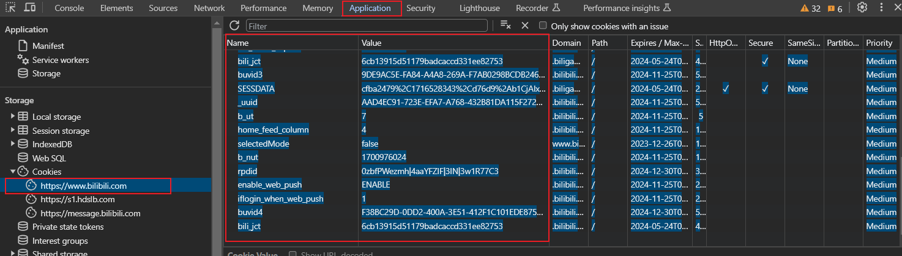

# Bilibili视频爬虫

## 使用环境
* lxml (Python 3)
* requests (Python 3)
* ffmpeg (官网下载并添加到系统环境变量PATH)
***
## 用法
    usage: bili.py [-h] [-ls] [-v] [-f] [-a] [-c] [-p PART] bv

    Bilibili命令行爬虫

    positional arguments:
      bv                    视频bv号

    options:
      -h, --help            show this help message and exit
      -ls, --list           从列表中选择
      -v, --video           下载视频选项，后方无需添加额外参数
      -f, --frames          下载无音频的画面选项，后方无需添加额外参数
      -a, --audio           下载音频选项，后方无需添加额外参数
      -c, --cover           下载封面选项，后方无需添加额外参数
      -p PART, --part PART  分P视频集数

### 示例：
#### 1. 通过BV号直接下载视频:
```bash
python bili.py BV1u841157Us -v 
```
或
```bash
python bili.py BV1u841157Us --video
```
#### 2. 通过BV号直接下载视频的音轨:
```bash
python bili.py BV1u841157Us -a
```
或
```bash
python bili.py BV1u841157Us --audio
```

#### 3. 通过BV号直接下载视频封面
```bash
python bili.py BV1u841157Us -c
```
或
```bash
python bili.py BV1u841157Us --cover
```

#### 4. 通过BV号直接下载视频画面（不含音轨）
```bash
python bili.py BV1u841157Us -f
```
或
```    
python bili.py BV1u841157Us --frames
```

#### 5. 同时下载画面，音轨，视频，和封面
```bash
python bili.py BV1u841157Us -a -f -v -c
```

选项参数可随意组合

#### 6. 从合集中选择下载视频

从合集中下载视频封面

    $> python bili.py BV1u841157Us -ls -c
    名称:  XXXXXX
    类型: 分P视频
    up主: XXX
     1 XXXXXXXX
     2 XXXXXXXX
     3 XXXXXXXX
    请选择视频: 

如果为分P视频，即使没有-ls参数也会自动进入视频集合选择

***
## Cookie的使用  

使用 cookie 可以获得 720P 及以上分辨率的视频。

```bash
python bili.py BV1u841157Us -v --cookie path/to/cookie.txt
```

### cookie.txt  
* 浏览器访问 http:\/\/bilibili.com，右键菜单或按f12打开检查
* 在检查工具顶栏中找到 Application/应用 栏，在左边的 Cookies 中找到 https://www.bilibili.com 
* 把右边的表格右键复制到 excel，在 excel 中删掉除 Name 和 Value 的其他所有列
* excel 中进行字符串拼接成 "Name=Value;" 的形式；excel 拼接公式：<font style="color: green">**=A1&"="&B1&\";"**</font>
* 最后把所有拼接的结果复制到 txt 文件，删掉换行符，保存即可



***

## 打包

```bash
pyinstaller bili.spec
```